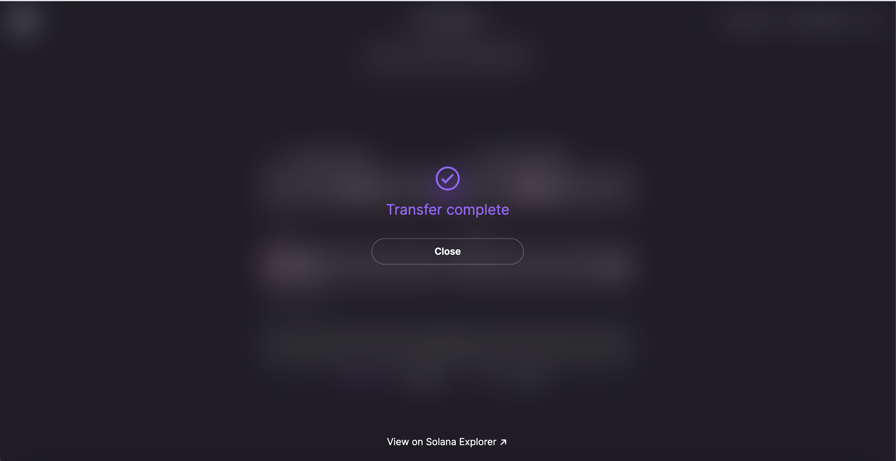

import Tabs from '@theme/Tabs';
import TabItem from '@theme/TabItem';
import image1 from '@site/static/img/doc-images/neonpass/connect-wallets.png';
import image2 from '@site/static/img/doc-images/neonpass/transfer.png';
import image3 from '@site/static/img/doc-images/neonpass/select_network.png';
import image4 from '@site/static/img/doc-images/neonpass/transfer1.png';

## TL;DR

- Transfer tokens to and from Solana and Neon networks with our [intuitive UI](https://neonpass.live/)
- No wrapping

## Overview

This guide demonstrates how to transfer tokens between Solana and Neon EVM using the [NeonPass](https://neonpass.live/) UI. The same tooling is available as an [npm package](/docs/developing/integrate/neon_transfer).

## Prerequisites

- EVM-compatible wallet (e.g. Atomic Wallet, MetaMask, etc.)
- Solana-compatible wallet (e.g. Phantom, Solfare, etc.)
- Token balance to pay gas fees

## Fees

- Access the NeonPass page using a browser where your wallet applications are attached.

Neon EVM is coming up with a [new feature](https://neonevm.org/blog/feature-alternative-gas-fee-token) in the following weeks on Devnet with which the users will have the option to pay the gas fees with the token they are transacting, rather than only NEON.

You can transfer tokens in either direction, but each transaction incurs a gas fee in either NEON or SOL or the token of your choice with which you are transacting.

> Under the hood, transferring tokens from Neon EVM to Solana requires the tansaction fees to be paid in NEON or (if supported) the transaction token as per the user's choice; whereas transferring tokens from Solana to Neon EVM requires the transaction fees to be paid in either NEON or SOL (depending on user's choice of token).

## Transfer tokens with NeonPass

### Step 1: Set up wallets

1.1 Navigate to [NeonPass](https://neonpass.live/).

1.2 Add your required Neon EVM network in your EVM-compatible wallet through [chainlist.org/chain/245022934](https://chainlist.org/?chain=245022934&search=Neon+EVM&testnets=true).

> For further help, see our [wallet setup walkthrough](/docs/wallet/metamask_setup).

### Step 2: Connect wallets to NeonPass

:::tip

Remember to use a browser to which both your Solana- and EVM-compatible wallets are attached.

:::

2.1 Select the network you want to connect to from the dropdown in the top right corner.

2.2 Click **Connect Wallet** to connect your Solana-compatible wallet to NeonPass. Follow the login procedure in your wallet's popup window and ensure it's connected to the network you require (e.g. Mainnet).

:::tip

Ensure you have enough funds to pay the withdrawal approval fee.

:::

2.3 Repeat this step for your EVM-compatible wallet.

After successfully connecting your wallets to NeonPass, the **Connect Wallet** text changes to the name of the network (Solana or Neon), and the public key of your accounts is displayed.

### Step 3: Conduct transfer

<Tabs>
  <TabItem value="neontosolana" label="Neon EVM to Solana" default>

3.1 Use the arrow to determine the direction of transfer (from Neon EVM to Solana).

3.2 Use the drop-down to select the token you want to transfer and enter the amount you want to send.

3.3 Click **Transfer**.

3.4 Confirm the transaction in your sending wallet.

> Always verify the transaction details and only approve if you wish to proceed.

A successful transaction is confirmed.

We hope that you love NeonPass and that you are ready to leverage the full potential of Neon EVM by facilitating hassle-free transfers of assets to and from Solana.

3.5 Don't trust: verify

If you wish to verify the transaction, click **View on Neon Explorer** to confirm on [NeonScan](https://neonscan.org) that the tokens were transferred. In the following example, 42 NEON were transferred out of Neon EVM.

Let's also check the destination Solana wallet address on [Solana Explorer](https://explorer.solana.com/) to verify the arrival of those 42 NEON tokens.

:::tip
Alternatively, use Blockscout's dedicated explorer [neon.blockscout.com](https://neon.blockscout.com) to search by transaction hash.
:::
</TabItem>

<TabItem value="solanatoneon" label="Solana to Neon EVM">

3.1 Use the arrow to determine the direction of transfer (from Solana to Neon EVM).

3.2 On the NeonPass screen, click `Choose token`. In the list that appears, select the desired token symbol and specify the quantity to be sent (in our example, it is 30 NEON).

3.3 There are two options for the token selection for the transaction fee. You can select either NEON or SOL from the bullet points below the `Transfer` button.

3.4 Click `Transfer` to begin the token transfer procedure. The transaction must then be confirmed in both the MetaMask and Phantom wallet windows which will pop up. Verify the transaction details and approve it if you wish to proceed. A loading screen will appear after you approve.

After the transaction has been processed successfully, you will see the following screen indicating that the transfer is complete.

3.5 Don't trust: verify

Click on `View on Solana Explorer` and confirm on SolScan that the tokens have been moved. In this case, 30 NEON was transferred out of the origin wallet.

</TabItem>
</Tabs>

## Under the hood

Neon EVM isn't a blockchain, and so it follows that NeonPass isn't a conventional blockchain bridge. Your assets are not wrapped. Instead, Neon EVM applies an ERC-20 interface, making SPL tokens behave like Ethereum-natives when in the Neon network. [Learn more about how NeonPass works](/docs/tokens/token-accounts).
